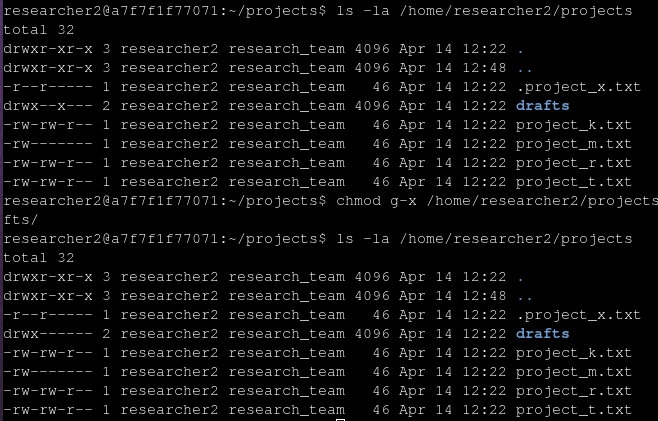

___
**About**: In this lab you're a security professional working with the permissions for the "research team" and ensure that they have the right permissions for the right repositories and files.

**Analyse folders and files ownership and permissions**:
	
Before changing permissions we need to verify if everything is set properly by using the command `ls -la`, that shows all files (including hidden ones) and their permissions:
![[images/show_files_dir_permissions.png]]

With this output it's possible to say that the "project_k.txt" and "project_m.txt" was created and given the wrong permissions according to the company's rules, so it's necessary to rectify it.

**Changing permissions of files**:
	
The file "project_k.txt" must be read/write only by the owner and the group, and anyone else.
The same problem we encounter with the "project_m.txt" that has reading permissions for group but must be only accessed and edited by the owner.
We can do that by "deleting" the permission using the minus after the subject we want to take the permission from ("u" for user, "g" for group and "o" for other users)
[[../images/changing_files_permissions.png]]

**Changing permissions of directory**:
	
The user "researcher2" has a "drafts" file that only he should access.

### Summary
In this lab we changed the groups and users permissions of files and directories on the research team 's lab according to the policies and rules of the company, increasing the security by working along with the CIA triad;
