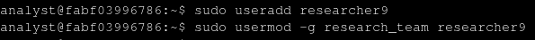

___
**About**: In this lab we have a new employee with the username of `researcher9` that will be taking care of a particular project at the organization.
Giving this, your job is to add a new user for them, give access to the specified file and manage their access during their time at the organization.
After that, we'll also how to add a user to secondary groups when this employee changed his role a couple of months later at the organization and his deletion after that, when he left the company an year later.

**Creating new user**:
	
When creating a new user we use the command `useradd` followed by the username you want to register. After creating the user, add it to the `research_team` system group so he can have access to all of the groups files using the command `usermod`:

**Changing file's ownership**:
	
As said about the employee, he'll be handling with a special project so he needs access to the file `project_r.txt`, which is only accessible by it's owner:

**Adding to secondary group**:
	
When adding primary and secondary groups(s) pay attention on the option:
- -g: for primary groups;
- -G: for secondary groups;
  

**Deleting user**:
	
With the command `userdel` we can delete the user easily, but attention with the output because when a user is created it's also create a group with the same name, so when deleting the user it's also necessary to delete it's group.

![[images/07_deleting_user_and_group.png]]