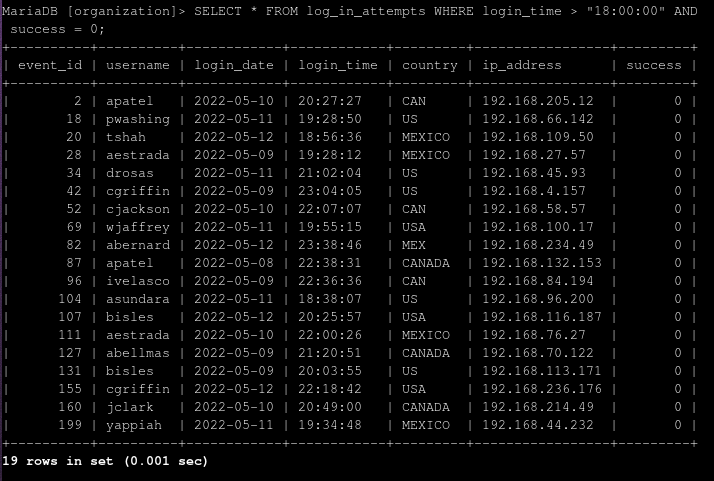
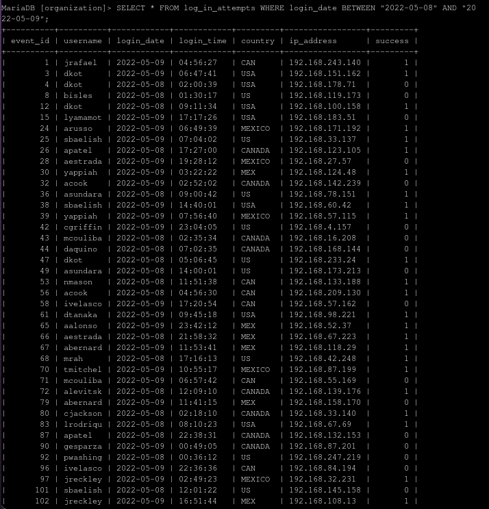
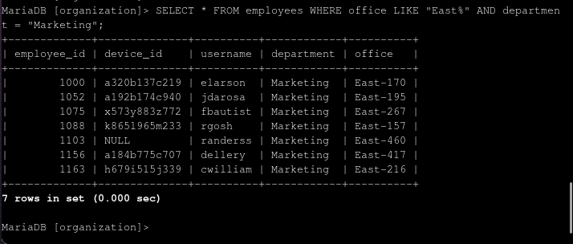
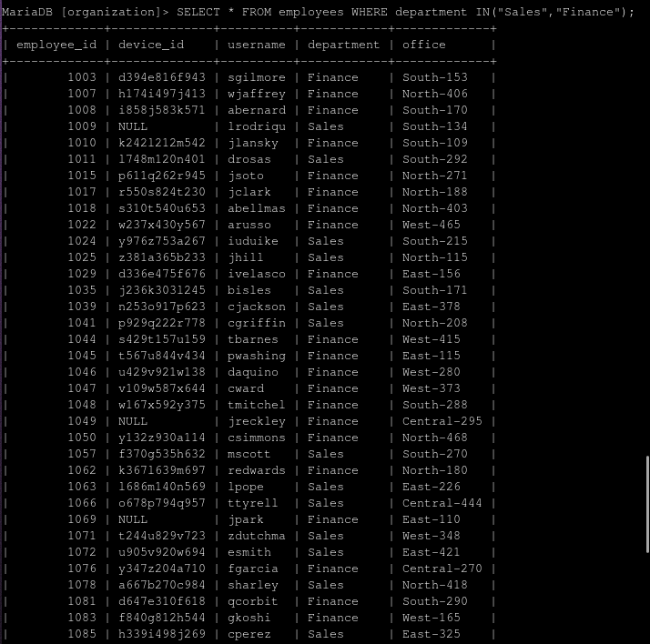

___
**About**: In this lab we'll work with a SQL database to get information about log in attempts, the place where it was accessed, time, etc.

**Scenario**: You'll be working as a professional network cybersecurity and recently discovered some potential security issues involving login attempts and employee machines.
To complete the lab, we can use data in the `employees` and `log_in_attempts` tables.

**Search for failed login attempts**:
On the search for the security threat, was said that the threat occurred after working hour, after 18:00 but happily has failed.
For that we will ask for every detail about the table `log_in_attempts` after working hours that has failed on the login (success column = 0):

**Retrieve specific dates incident**:
Another day, the network analyst ask you the login attempts of the days 09-05-2022 and 08-05-2022 because a problem happened at day 9.

(too much entries to show here)

**Search computer for security updates**:
	
Your team want to perform security updates on a specific machine in the east building marketing department and you need to search for this machine using the `employees` table.
For this task we'll use the `LIKE` operator since we have more than just one east office:

Continuing with the security updates, now the team needs to perform the updates at all computers at the sales and finance departments.
For that we have 2 options: use `OR` or `IN`, but here we will use `IN`:

